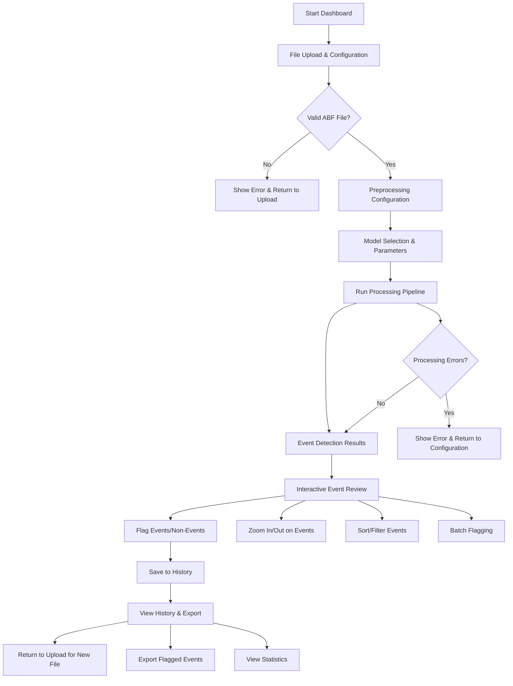
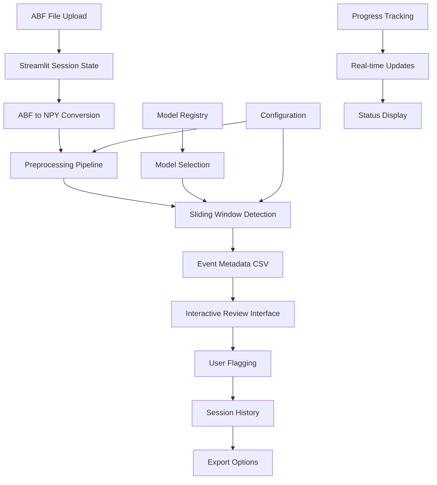

# Task 3: Interactive Dashboard for Sliding Window Event Detection Tool

## Task Overview

Create an interactive Streamlit dashboard that serves as an assistance tool for event detection using the sliding window tool. The dashboard will allow users to upload ABF traces, process them through the preprocessing pipeline, run sliding window event detection, and interactively review and flag detected events.

## Current System Analysis

### Sliding Window Tool (`scripts/model_event_extraction/model_event_extraction.py`)

**Key Parameters:**

- `--input_path`: Path to preprocessed .npy file
- `--model_path`: Path to trained model (.pth file)
- `--window_size`: Number of samples per window (default: 540)
- `--overlap`: Window overlap fraction (default: 0.95)
- `--threshold`: Classification threshold (default: 0.75)
- `--no_save_segments`: Skip saving segments.npy file

**Output:**

- `metadata.csv`: Event metadata (start_time_s, end_time_s, source_npy)
- `model_extraction_summary.json`: Extraction parameters and model metadata
- `segments.npy`: Event segments (optional, disabled for dashboard)

### Preprocessing Pipeline

**ABF to NPY Conversion:**

- Input: ABF files from electrophysiological recordings
- Output: NPY files with [time(s), current(pA)] format

**Main Preprocessing:**

- Baseline correction (default: 0.05s window)
- Thresholding (default: 137.329)
- Low-pass filtering (default: calculated cutoff)
- Savitzky-Golay smoothing (default: window=15, polyorder=3)
- Downsampling (default: factor=1)
- Z-score normalization

### Model Registry

**Available Models:**

- CNN1D, FCN1D, RNN1D, DARTS models
- Metadata includes training configuration, performance metrics, preprocessing info
- Filtering by model type, performance, training date

## UI/UX Design and Flow

### Application Architecture

```
┌─────────────────────────────────────────────────────────────────┐
│                    MINIS Event Detection Dashboard              │
├─────────────────────────────────────────────────────────────────┤
│  Navigation: [File Upload] [Processing] [Event Review] [History]│
├─────────────────────────────────────────────────────────────────┤
│                                                                 │
│  Main Content Area (Dynamic based on navigation)                │
│                                                                 │
├─────────────────────────────────────────────────────────────────┤
│  Status Bar: Processing status, warnings, model compatibility   │
└─────────────────────────────────────────────────────────────────┘
```

### Navigation Flow



### Detailed Page Designs

#### 1. File Upload & Configuration Page

**Layout:**

```
┌─────────────────────────────────────────────────────────────────┐
│  📁 File Upload & Configuration                                 │
├─────────────────────────────────────────────────────────────────┤
│                                                                 │
│  [Upload ABF File]                                              │
│  Supported formats: .abf                                        │
│  Max file size: 100MB                                           │
│                                                                 │
│  📊 File Information (when uploaded)                            │
│  ┌─────────────────────────────────────────────────────────────┐ │
│  │ File: example.abf                                           │ │
│  │ Size: 25.3 MB                                               │ │
│  │ Duration: 120.5 seconds                                     │ │
│  │ Sampling Rate: 20,000 Hz                                    │ │
│  └─────────────────────────────────────────────────────────────┘ │
│                                                                 │
│  ⚙️ Preprocessing Configuration                                 │
│  ┌─────────────────────────────────────────────────────────────┐ │
│  │ Baseline Duration: [0.05] seconds                           │ │
│  │ Downsample Factor: [1]                                      │ │
│  │ Cutoff Frequency: [Auto] Hz                                 │ │
│  │ Savgol Window: [15] samples                                 │ │
│  │ Savgol Polyorder: [3]                                       │ │
│  │ Threshold Value: [137.329]                                  │ │
│  └─────────────────────────────────────────────────────────────┘ │
│                                                                 │
│  [Use Default Settings] [Customize Settings]                   │
│                                                                 │
│  [Next: Model Selection]                                        │
└─────────────────────────────────────────────────────────────────┘
```

#### 2. Model Selection & Parameters Page

**Layout:**

```
┌─────────────────────────────────────────────────────────────────┐
│  🤖 Model Selection & Parameters                                │
├─────────────────────────────────────────────────────────────────┤
│                                                                 │
│  📋 Available Models                                            │
│  ┌─────────────────────────────────────────────────────────────┐ │
│  │ Filter by: [All Types ▼] [Performance ▼] [Date ▼]          │ │
│  │                                                             │ │
│  │ ☑️ CNN1D - segments_20250326_174120 (F1: 0.97)             │ │
│  │ ☐ FCN1D - segments_20250321_110022 (F1: 0.89)              │ │
│  │ ☐ RNN1D - segments_20250324_135723 (F1: 0.96)              │ │
│  │ ☐ DARTS - segments_20250323_142120 (F1: 0.85)              │ │
│  └─────────────────────────────────────────────────────────────┘ │
│                                                                 │
│  ⚠️ Model Compatibility Warning                                │
│  ┌─────────────────────────────────────────────────────────────┐ │
│  │ ⚠️ Selected model trained with different preprocessing:     │ │
│  │    - Model baseline_duration: 0.05s                        │ │
│  │    - Current baseline_duration: 0.05s ✅                   │ │
│  │    - Model downsample_factor: 1                             │ │
│  │    - Current downsample_factor: 1 ✅                        │ │
│  └─────────────────────────────────────────────────────────────┘ │
│                                                                 │
│  🎯 Detection Parameters                                        │
│  ┌─────────────────────────────────────────────────────────────┐ │
│  │ Window Size: [540] samples (~27ms at 20kHz)                │ │
│  │ Overlap: [0.95] (95%)                                       │ │
│  │ Threshold: [0.75] (75% confidence)                          │ │
│  │                                                             │ │
│  │ [Use Model Defaults] [Customize]                            │ │
│  └─────────────────────────────────────────────────────────────┘ │
│                                                                 │
│  [Previous] [Start Processing]                                  │
└─────────────────────────────────────────────────────────────────┘
```

#### 3. Processing Status Page

**Layout:**

```
┌─────────────────────────────────────────────────────────────────┐
│  ⚙️ Processing Pipeline                                          │
├─────────────────────────────────────────────────────────────────┤
│                                                                 │
│  📊 Progress Overview                                           │
│  ┌─────────────────────────────────────────────────────────────┐ │
│  │ Overall Progress: ████████████████████░░ 85%               │ │
│  │ Estimated Time Remaining: 2 minutes 30 seconds              │ │
│  └─────────────────────────────────────────────────────────────┘ │
│                                                                 │
│  🔄 Current Step: Event Detection                              │
│  ┌─────────────────────────────────────────────────────────────┐ │
│  │ ✅ ABF to NPY Conversion (completed)                       │ │
│  │ ✅ Preprocessing (completed)                                │ │
│  │ 🔄 Sliding Window Detection (in progress)                   │ │
│  │   - Windows processed: 15,432 / 18,000                      │ │
│  │   - Events detected: 23                                     │ │
│  │ ⏳ Event Grouping (pending)                                 │ │
│  │ ⏳ Metadata Generation (pending)                            │ │
│  └─────────────────────────────────────────────────────────────┘ │
│                                                                 │
│  📈 Real-time Statistics                                       │
│  ┌─────────────────────────────────────────────────────────────┐ │
│  │ Processing Speed: 1,200 windows/second                      │ │
│  │ Memory Usage: 45.2 MB                                       │ │
│  │ CPU Usage: 78%                                              │ │
│  └─────────────────────────────────────────────────────────────┘ │
│                                                                 │
│  [Cancel Processing]                                            │
└─────────────────────────────────────────────────────────────────┘
```

#### 4. Event Review Page

**Layout:**

```
┌─────────────────────────────────────────────────────────────────┐
│  🔍 Event Review & Flagging                                     │
├─────────────────────────────────────────────────────────────────┤
│                                                                 │
│  📊 Detection Summary                                           │
│  ┌─────────────────────────────────────────────────────────────┐ │
│  │ Total Events Detected: 47                                   │ │
│  │ Processing Time: 3 minutes 12 seconds                       │ │
│  │ Average Confidence: 0.82                                    │ │
│  │ [View Raw Trace] [Export Results]                           │ │
│  └─────────────────────────────────────────────────────────────┘ │
│                                                                 │
│  🎯 Event Navigation                                            │
│  ┌─────────────────────────────────────────────────────────────┐ │
│  │ Event: [◀ Previous] [23 of 47] [Next ▶]                    │ │
│  │ Time: 45.23s - 45.31s (8ms duration)                       │ │
│  │ Confidence: 0.89                                            │ │
│  └─────────────────────────────────────────────────────────────┘ │
│                                                                 │
│  📈 Event Visualization                                         │
│  ┌─────────────────────────────────────────────────────────────┐ │
│  │ [Zoom Controls: 🔍+ 🔍- 🏠] [Time Range: 44.5s - 46.0s]    │ │
│  │                                                             │ │
│  │ ┌─────────────────────────────────────────────────────────┐ │ │
│  │ │                    Event Plot                           │ │ │
│  │ │              (Interactive Plotly Chart)                 │ │ │
│  │ │                                                         │ │ │
│  │ │  Current: ████████████████████████████████████████████  │ │ │
│  │ │  Event:   ████████████████████████████████████████████  │ │ │
│  │ └─────────────────────────────────────────────────────────┘ │ │
│  └─────────────────────────────────────────────────────────────┘ │
│                                                                 │
│  🏷️ Event Classification                                        │
│  ┌─────────────────────────────────────────────────────────────┐ │
│  │ [✅ Confirm Event] [❌ Mark as Non-Event] [⏭️ Skip]         │ │
│  │                                                             │ │
│  │ Notes: [Add optional notes about this event]               │ │
│  └─────────────────────────────────────────────────────────────┘ │
│                                                                 │
│  📋 Batch Operations                                            │
│  ┌─────────────────────────────────────────────────────────────┐ │
│  │ [Flag All Remaining as Events] [Flag All Remaining as Non-Events] │
│  │ [Export Current Progress] [Save to History]                │ │
│  └─────────────────────────────────────────────────────────────┘ │
└─────────────────────────────────────────────────────────────────┘
```

#### 5. History & Export Page

**Layout:**

```
┌─────────────────────────────────────────────────────────────────┐
│  📚 Analysis History & Export                                   │
├─────────────────────────────────────────────────────────────────┤
│                                                                 │
│  📊 Analysis Summary                                            │
│  ┌─────────────────────────────────────────────────────────────┐ │
│  │ Total Files Analyzed: 8                                     │ │
│  │ Total Events Flagged: 156                                   │ │
│  │ Confirmed Events: 89                                        │ │
│  │ Rejected Events: 67                                         │ │
│  │ Average Processing Time: 2.3 minutes                        │ │
│  └─────────────────────────────────────────────────────────────┘ │
│                                                                 │
│  📋 File History                                                │
│  ┌─────────────────────────────────────────────────────────────┐ │
│  │ Filter: [All Files ▼] [Date Range ▼] [Model Type ▼]        │ │
│  │                                                             │ │
│  │ 📄 example1.abf (2024-01-15 14:30)                         │ │
│  │    Events: 23 | Confirmed: 18 | Rejected: 5                 │ │
│  │    Model: CNN1D | Processing: 2.1 min                      │ │
│  │    [View Details] [Re-analyze] [Delete]                     │ │
│  │                                                             │ │
│  │ 📄 example2.abf (2024-01-15 15:45)                         │ │
│  │    Events: 31 | Confirmed: 22 | Rejected: 9                 │ │
│  │    Model: RNN1D | Processing: 3.2 min                      │ │
│  │    [View Details] [Re-analyze] [Delete]                     │ │
│  └─────────────────────────────────────────────────────────────┘ │
│                                                                 │
│  📤 Export Options                                              │
│  ┌─────────────────────────────────────────────────────────────┐ │
│  │ [Export All Confirmed Events] [Export All Rejected Events] │ │
│  │ [Export Analysis Summary] [Export Processing Logs]         │ │
│  │                                                             │ │
│  │ Format: [CSV ▼] [JSON ▼] [Excel ▼]                         │ │
│  │ Include: ☑️ Event metadata ☑️ Processing parameters ☑️ Notes │ │
│  └─────────────────────────────────────────────────────────────┘ │
│                                                                 │
│  [New Analysis] [Clear History] [Export All]                   │
└─────────────────────────────────────────────────────────────────┘
```

## Technical Specifications

### Data Flow Architecture



### Database Schema (Temporary CSV Storage)

**Analysis Sessions (`analysis_sessions.csv`):**

```csv
session_id,file_name,upload_timestamp,processing_timestamp,model_path,preprocessing_config,detection_config,status,processing_time_seconds
```

**Detected Events (`detected_events.csv`):**

```csv
session_id,event_index,start_time_s,end_time_s,confidence,user_flag,user_notes,flag_timestamp
```

**Processing Logs (`processing_logs.csv`):**

```csv
session_id,step,start_timestamp,end_timestamp,status,error_message,performance_metrics
```

### Key Features Implementation

#### 1. File Upload & Validation

- **ABF file validation**: Check file format, size limits
- **Progress tracking**: Real-time upload progress
- **File information extraction**: Duration, sampling rate, size

#### 2. Preprocessing Pipeline Integration

- **Parameter validation**: Ensure parameters are within valid ranges
- **Progress monitoring**: Real-time progress updates for each step
- **Error handling**: Graceful handling of preprocessing failures
- **Configuration persistence**: Save/load preprocessing configurations

#### 3. Model Selection & Compatibility

- **Model registry integration**: Query available models with filtering
- **Compatibility checking**: Compare preprocessing parameters with model training
- **Performance metrics display**: Show model F1 scores, accuracy
- **Parameter suggestions**: Auto-suggest optimal parameters based on model

#### 4. Interactive Event Review

- **Plotly integration**: Interactive zoom, pan, hover information
- **Event navigation**: Previous/next, jump to specific events
- **Batch operations**: Flag multiple events at once
- **Notes system**: Add user notes to events
- **Confidence display**: Show model confidence for each event

#### 5. History Management

- **Session persistence**: Save analysis sessions across browser sessions
- **File management**: Re-analyze, delete, export individual files
- **Statistics tracking**: Overall performance metrics
- **Export functionality**: Multiple format support (CSV, JSON, Excel)

### Error Handling & User Experience

#### 1. Processing Errors

- **Graceful degradation**: Continue with partial results when possible
- **Error recovery**: Suggest fixes for common issues
- **Progress preservation**: Save partial results for recovery

#### 2. User Guidance

- **Tooltips**: Explain parameters and their effects
- **Warnings**: Alert users to potential issues (model compatibility)
- **Help system**: Contextual help for each section
- **Best practices**: Suggest optimal configurations

#### 3. Performance Optimization

- **Background processing**: Non-blocking UI during processing
- **Memory management**: Efficient handling of large files
- **Caching**: Cache processed results for faster re-analysis
- **Progressive loading**: Load results incrementally

### Security & Data Management

#### 1. File Security

- **Temporary storage**: Files stored in session-specific directories
- **Automatic cleanup**: Remove temporary files after session
- **Size limits**: Prevent memory issues with large files

#### 2. Data Privacy

- **Local processing**: All processing done locally
- **No external uploads**: Files never leave user's system
- **Session isolation**: Data isolated between sessions

## Implementation Plan

### Phase 1: Core Infrastructure

1. **Project setup**: Create Streamlit app structure
2. **File upload system**: ABF file handling and validation
3. **Basic preprocessing integration**: Pipeline connection
4. **Model registry integration**: Model selection interface

### Phase 2: Processing Pipeline

1. **ABF to NPY conversion**: Integration with existing script
2. **Preprocessing pipeline**: Full integration with parameter control
3. **Sliding window detection**: Integration with event extraction
4. **Progress tracking**: Real-time status updates

### Phase 3: Interactive Review

1. **Event visualization**: Plotly-based interactive plots
2. **Event navigation**: Previous/next, filtering, sorting
3. **Flagging system**: Event/non-event classification
4. **Notes system**: User annotation capabilities

### Phase 4: History & Export

1. **Session management**: Save/load analysis sessions
2. **History interface**: File management and statistics
3. **Export functionality**: Multiple format support
4. **Data cleanup**: Automatic temporary file management

### Phase 5: Polish & Optimization

1. **Error handling**: Comprehensive error management
2. **User experience**: Tooltips, help, best practices
3. **Performance optimization**: Caching, memory management
4. **Testing**: Comprehensive testing and validation

## Success Criteria

### Functional Requirements

- ✅ Upload and process ABF files through complete pipeline
- ✅ Interactive event review with zoom/pan capabilities
- ✅ Event flagging system with notes
- ✅ Model selection with compatibility warnings
- ✅ History management and export functionality
- ✅ Real-time progress tracking and error handling

### Performance Requirements

- ✅ Process files up to 100MB within reasonable time
- ✅ Responsive UI during processing
- ✅ Efficient memory usage for large datasets
- ✅ Fast event navigation and visualization

### User Experience Requirements

- ✅ Intuitive navigation and workflow
- ✅ Clear error messages and recovery options
- ✅ Helpful tooltips and guidance
- ✅ Consistent design and branding

## Technical Dependencies

### Core Libraries

- **Streamlit**: Web application framework
- **Plotly**: Interactive visualizations
- **Pandas**: Data manipulation and CSV handling
- **NumPy**: Numerical computing
- **PyABF**: ABF file reading

### Integration Points

- **Model Registry**: `scripts/analysis/core/model_registry.py`
- **Sliding Window Tool**: `scripts/model_event_extraction/model_event_extraction.py`
- **Preprocessing Pipeline**: `scripts/preprocessing/main_preprocessing.py`
- **ABF Conversion**: `scripts/preprocessing/abf_to_npy_data_conversion.py`

### Project Root Integration

- **Path Management**: Use `src/utils/paths.py` for robust path resolution
- **Import Patterns**: Follow established patterns from Task 1
- **Configuration**: Integrate with existing project structure

This comprehensive design provides a solid foundation for implementing the interactive dashboard, ensuring it meets all user requirements while maintaining consistency with the existing project architecture and best practices established in previous tasks.
